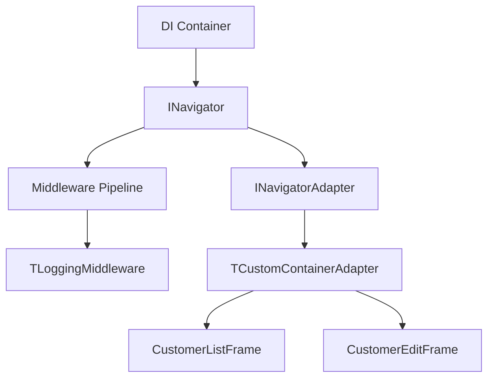

# 🏢 Desktop.Modern.CustomerCRUD

Exemplo de aplicação Desktop moderna usando Dext Framework, demonstrando padrões de desenvolvimento profissional, desacoplamento extremo, produtividade via Magic Binding, e **navegação com pipeline de middlewares**.

## 🎯 O Que Este Exemplo Demonstra

| Recurso | Descrição |
|---------|-----------|
| **Controller Pattern** | Orquestração de lógica separada da View via Interface (`ICustomerController`) |
| **Magic Binding (UI)** | Binding bidirecional automático via Atributos (`[BindEdit]`, `[BindText]`, etc) |
| **Navigator** | Navegação entre telas com middlewares, guards e adapters |
| **Injeção de Dependência** | Services e Controllers injetados via DI Container |
| **Arquitetura Desacoplada** | Comunicação entre Controller e View via Interface (`ICustomerView`) |
| **ORM & Validação** | Entidades mapeadas com atributos e validação automática no ViewModel |
| **Logging** | Log de operações injetado e padronizado via ILogger |

## 📂 Estrutura do Projeto (Feature Folders)

Este exemplo utiliza a abordagem de **Feature Folders**, agrupando arquivos por funcionalidade de negócio em vez de tipo técnico. Isso melhora a coesão, facilita a manutenção e torna o projeto altamente escalável.

```
Desktop.Modern.CustomerCRUD/
├── App/
│   └── App.Startup.pas         # Configuração DI, Navigator e Lifecycle
├── Features/
│   ├── Customers/              # Tudo sobre a funcionalidade de Clientes
│   │   ├── Customer.Entity.pas
│   │   ├── Customer.Service.pas
│   │   ├── Customer.Controller.pas
│   │   ├── Customer.ViewModel.pas
│   │   ├── Customer.List.pas
│   │   └── Customer.Edit.pas
│   └── Layout/                 # Estrutura base da aplicação
│       └── Main.Form.pas
├── Data/                       # Persistência e Contexto (infra)
└── DesktopModernCustomerCRUD.dpr
```

## 🧭 Navigator Framework

O Navigator é um sistema de navegação inspirado no Flutter, com suporte a:

### API Básica
```pascal
// Configuração
Navigator
  .UseAdapter(TCustomContainerAdapter.Create(ContentPanel))
  .UseMiddleware(TLoggingMiddleware.Create(Logger));

// Navegação
Navigator.Push(TCustomerEditView);
Navigator.Pop;
Navigator.PopUntil(THomeView);
Navigator.Replace(TNewView);
```

### Pipeline de Middlewares
```pascal
Navigator
  .UseMiddleware(TLoggingMiddleware.Create(Logger))     // Log de navegações
  .UseMiddleware(TAuthMiddleware.Create(AuthService))   // Verificar autenticação
  .UseMiddleware(TRoleMiddleware.Create(AuthService, 'Admin')); // Checar permissões
```

### Adapters Disponíveis
- `TCustomContainerAdapter` - Para painéis/scrollbox
- `TPageControlAdapter` - Para navegação com tabs
- `TMDIAdapter` - Para janelas MDI



## 🚀 Magic Binding (O "Pulo do Gato")

A grande inovação deste exemplo é o uso de **Atributos de UI**:

```pascal
[BindEdit('Name')]
NameEdit: TEdit;

[BindText('Errors.Text')]
ErrorsLabel: TLabel;

[OnClickMsg(TSaveMsg)]
SaveButton: TButton;
```

A sincronização de dados e o despacho de mensagens são tratados automaticamente pela engine `Dext.UI`.

---

## 🧪 Unit Tests

Este projeto inclui uma suíte completa de testes unitários usando `Dext.Testing` e `Dext.Mocks`:

```
CustomerCRUD.Tests.dproj
├── TCustomerRulesTests (12 tests)     # Validação de regras de negócio
├── TCustomerViewModelTests (6 tests)  # Estado e validação do ViewModel
└── TCustomerControllerTests (3 tests) # Controller com mocks injetados
```

### Executando os Testes
```powershell
msbuild CustomerCRUD.Tests.dproj /t:Build /p:Config=Debug /p:Platform=Win32
.\CustomerCRUD.Tests.exe
```

### Exemplo de Teste com Mocking
```pascal
[TestFixture('Customer Controller')]
TCustomerControllerTests = class
private
  FServiceMock: Mock<ICustomerService>;
  FController: ICustomerController;
public
  [Setup]
  procedure Setup;
  
  [Test]
  procedure TestLoadCustomers_CallsService;
end;

procedure TCustomerControllerTests.Setup;
begin
  FServiceMock := Mock<ICustomerService>.Create;
  FController := TCustomerController.Create(FServiceMock.Instance, ...);
end;

procedure TCustomerControllerTests.TestLoadCustomers_CallsService;
begin
  // Arrange
  var Customers := TCollections.CreateList<TCustomer>;
  FServiceMock.Setup.Returns(TValue.From(Customers)).When.GetAll;
  
  // Act  
  FController.LoadCustomers;
  
  // Assert
  FServiceMock.Received.GetAll;
end;
```

---

## 📋 Business Rules (TCustomerRules)

Regras de validação encapsuladas em classe estática, testáveis e reutilizáveis:

| Regra | Descrição |
|-------|-----------|
| `ValidateName` | Nome obrigatório, mínimo 3 caracteres |
| `ValidateEmail` | Email obrigatório, formato válido |
| `ValidatePhone` | Opcional, formato brasileiro |
| `ValidateDocument` | Opcional, mínimo 5 caracteres |
| `IsEmailUnique` | Verifica duplicidade de email |
| `ValidateAll` | Valida todas as regras de uma vez |

```pascal
// Uso no ViewModel
function TCustomerViewModel.Validate: Boolean;
var
  ErrorArray: TArray<string>;
begin
  FErrors.Clear;
  Result := TCustomerRules.ValidateAll(FCustomer, ErrorArray);
  for S in ErrorArray do
    FErrors.Add(S);
end;
```

---

## 🔧 Como Executar

1. Abra `DesktopMVVMCustomerCRUD.dproj` no Delphi.
2. Certifique-se de que os fontes do Dext Framework estão no Library Path.
3. Compile (Ctrl+F9) e Execute (F9).

---

## 🗺 Roadmap Futuro (Dext UI Evolution)

- [x] **Navigation Service**: Um serviço de navegação centralizado com middleware pipeline
- [x] **Unit Tests**: Testes unitários com mocking para Controller, ViewModel e Rules
- [ ] **Grid Binder**: Implementar um `[BindGrid]` que sincronize automaticamente uma `IList<T>` com um `TStringGrid`
- [ ] **Validation Interceptors**: Atributos de validação que mudem a cor das bordas automaticamente
- [ ] **Deep Linking**: Suporte a navegação via URLs/argumentos de linha de comando

---

*Dext Framework - Modern Desktop Development for Delphi*

